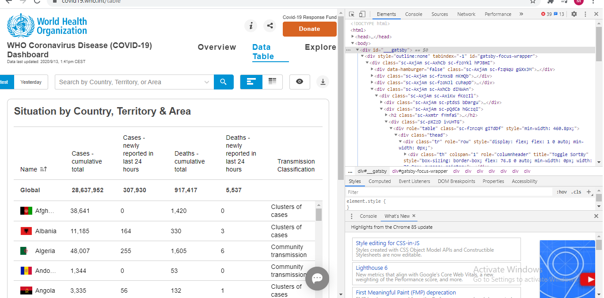

# Selenium-web-scraping
# what is Selenium
Selenium is a portable framework for testing web applications. Selenium provides a playback tool for authoring functional tests without the need to learn a test scripting language and also used in Scraping
# Selenium in webscraping
Selenium is a tool to automate browsers. It's primarily used for testing but is also very useful for web scraping. You can check out the unofficial documentation here.

# why should you learn it ?
Any one interested in Data must have the knowledge of Scraping(Data Engineer,Data Scientist, Data Analyst)
Web scraping can help you extract any kind of data that you want. ... You would then be able to retrieve, analyze and use the data the way you want. So web scraping simplifies the process of extracting data, speeds it up by automating it and creates easy access to the scrapped data by providing it in a CSV format.

### if you want to learn more check the documentation
https://selenium-python.readthedocs.io/

# How to install Selenium 
pip install selenium

# You have to download a ChromeDriver that is compatable with your chrome version
https://chromedriver.chromium.org/downloads

The main purpose of the ChromeDriver is to launch Google Chrome. Without that, it is not possible to execute Selenium test scripts in Google Chrome as well as automate any web application. This is the main reason why you need ChromeDriver to run test cases on Google Chrome browser.

### This notebook is for any beginner that want to start with webscraping using selenium
1. Learning the principels of Selenium
2. Locating Elements From HTML
3. Page Navigating and Clicking Elements
4. Understanding the different ways to fetch your data

The website i tried selenium on it is https://covid19.who.int/table it's about the corona virus spreading in all the countries

First when you open any webpage you want to scrape you have to inspect the page to see the Data you want to target.

### You can specify the data you want using many ways
1. Id 
first = driver.find_element_by_id("")
2. Class name
first = driver.find_element_by_class_name
3. Xpath
first = driver.find_element_by_xpath
4. Tag name
first = driver.find_element_by_tag_name
5. etc..

## Page Navigating and Clicking Elements
One of the most fundamental and crucial interactions while Selenium automation testing is done by automating click operations over elements on a web page. We facilitate the click interaction using a method called Selenium. click(). ... We will automate from basic to advanced interactions through the click

Link = driver.find_element_by_link_text('The Link word you want to go to')
Link.click()

